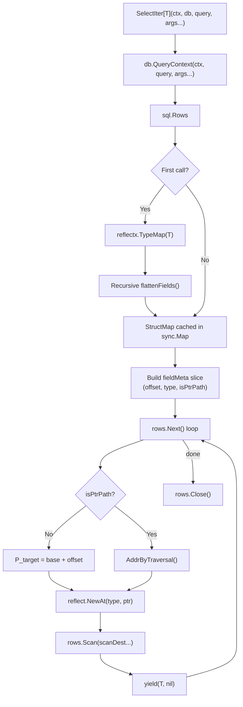

# Architecture of sqlx-v2

Internal design reference for contributors and maintainers.

## Project Layout

| Package | Responsibility |
| :--- | :--- |
| `sqlx` (root) | Public API: `DB`, `Tx`, `Rows`, `Select`, `Get`, `SelectG`, `GetG`, `SelectIter`, etc. |
| `internal/reflectx` | Type flattening, recursive offset calculation, `StructMap`/`FieldInfo` caching via `sync.Map`. |
| `internal/bind` | SQL parameter binding (`?`, `$1`, `@p1`, `:name`) per driver dialect. |
| `internal/shadow` | Integration tests comparing v2 against `jmoiron/sqlx` (v1). |
| `internal/testutil` | Testcontainers helpers for PostgreSQL and MySQL. |
| `internal/mockdb` | Mock `database/sql` driver for benchmarks and fuzz tests. |

### Drop-in Compatibility Interfaces

The root package exports `Queryer`, `QueryerContext`, `Execer`, `ExecerContext`, `Ext`, `ExtContext`, `Preparer`, `PreparerContext`, and `ColScanner` to maintain API compatibility with `jmoiron/sqlx`. These exist for user code that depends on them for mocking or abstraction. Internally, sqlx-v2 calls struct methods directly.

---

## Query Lifecycle

The diagram traces `SelectIter[T]` from call to yield:



### Discovery (once per type)

When a struct type `T` is first encountered:

1. `reflectx.Mapper.TypeMap(T)` walks the type via `reflect`, recursively flattening embedded structs.
2. For each leaf field, the absolute byte offset from the struct base is computed: `parent.Offset + field.Offset`.
3. Fields reached through pointer embeddings are flagged `IsPtrPath = true` and use traversal-based addressing at scan time.
4. The resulting `StructMap` is cached in a `sync.Map` keyed by `reflect.Type`. Subsequent calls hit the cache.

### Scan (per row)

Inside the `rows.Next()` loop:

1. A new `T` is allocated via `reflect.New(elemType)`.
2. The base address is extracted: `base := unsafe.Pointer(vp.Pointer())`.
3. For each column, the field pointer is computed: `ptr := unsafe.Pointer(uintptr(base) + offset)`.
4. The pointers are wrapped via `reflect.NewAt(fieldType, ptr)` and collected into `scanDest`.
5. `rows.Scan(scanDest...)` writes directly into the struct's memory.
6. The struct is appended to a slice (`SelectG`) or yielded to the caller (`SelectIter`).

---

## Memory Management

### SelectIter and Peak Memory

`SelectIter` yields one row at a time without materializing the full result set. Peak memory is O(1) relative to row count — only one `T` is live at any point. This matters when streaming large result sets directly to an I/O writer (e.g., JSON encoding).

### Scan Buffer Pool

`engine.go` maintains a `sync.Pool` of `[]any` slices used as scan destinations. Each scan borrows a slice, populates it with field pointers, passes it to `rows.Scan`, and returns it to the pool. This avoids allocating a new `[]any` per row.

```go
var scanPool = sync.Pool{
    New: func() any {
        var s []any
        return &s
    },
}
```

### Offset Computation

`internal/reflectx` computes absolute offsets during struct flattening. For value embeddings, offsets are additive:

```text
AbsoluteOffset = ParentOffset + field.Offset
```

For pointer embeddings, the offset is meaningless across the pointer indirection. `AddrByTraversal` dereferences the pointer chain at scan time, allocating intermediate structs as needed.

### Cache Keys

The `sync.Map` is keyed by `reflect.Type`, not by string name. Two types with identical layouts but different definitions (`type A struct{ X int }` vs `type B struct{ X int }`) get separate cache entries. Verified in `internal/reflectx/poison_test.go`.

---

## Correctness Invariants

The scan engine uses `unsafe.Pointer(uintptr(base) + offset)`. The following invariants ensure this is safe.

### GC Liveness

All scan paths call `runtime.KeepAlive(vp)` after `rows.Scan` completes:

```go
vp := reflect.New(elemType)              // heap allocation
base := unsafe.Pointer(vp.Pointer())     // derive base pointer
// ... populate scanDest from base + offsets ...
rows.Scan(scanDest...)                    // driver writes to memory
runtime.KeepAlive(vp)                    // prevent premature collection
```

Without `KeepAlive`, the compiler's liveness analysis may determine `vp` is unreachable after `base` is extracted. The GC could then collect the struct while `rows.Scan` is still writing to it.

### Write Barriers

Fields behind pointer embeddings (`*EmbeddedStruct`) require runtime allocation of the intermediate struct. `AddrByTraversal` handles this:

```go
vp := reflect.New(step.Type)
reflect.NewAt(reflect.PointerTo(step.Type), ptr).Elem().Set(vp)
```

The `Set()` call triggers Go's write barrier, making the GC aware of the new allocation. A raw `*(*unsafe.Pointer)(ptr) = ...` would bypass the barrier, leaving the GC unaware of the pointer — a use-after-free waiting to happen.

### Alignment

All offsets come from `reflect.StructField.Offset`, which the compiler guarantees to be correctly aligned for the target architecture. No manual alignment arithmetic is performed.

### `unsafe.Pointer` Rule Compliance

| Rule | Usage |
| :--- | :--- |
| **(3)** `reflect.Value.Pointer()` → `unsafe.Pointer` | `base := unsafe.Pointer(vp.Pointer())` |
| **(4)** Arithmetic on converted pointer | `ptr := unsafe.Pointer(uintptr(base) + offset)` |

The conversion and arithmetic happen in a single expression. No `uintptr` value is stored in a variable or passed across function boundaries, which would allow the GC to relocate the underlying object between the conversion and the addition.

---

## Testing

### Fuzz Targets

| Target | Invariant | Scope |
| :--- | :--- | :--- |
| `FuzzTypeMap` | `Offset + sizeof(Field) ≤ sizeof(Struct)` | Randomized padding and zero-width fields |
| `FuzzRowScanBounds` | No panics on arbitrary driver output | Fuzzed column values against fixed schemas |

### Property-Based Tests

- **Round-trip symmetry:** `Get(ID)` returns the same data written by `NamedExec(Struct)`, verified with generated struct types.
- **Allocation ceiling:** ≤ 3 allocs/row, enforced via `testing.AllocsPerRun`.

### Network Resilience (Toxiproxy)

Toxiproxy injects failures during active scans:

1. `reset_peer` mid-read over 50k+ rows — verifies error propagation and context cancellation.
2. Silent connection drops — verifies the driver doesn't stall indefinitely.
3. `-race` on teardown — verifies no goroutine leaks or dangling pool references.

All test suites run under `-race`. Fuzz tests additionally run under `-msan` where supported.
