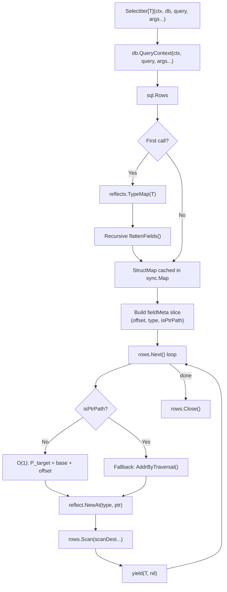

# Architecture of sqlx-v2

This document describes the internal design of `sqlx-v2` for contributors and maintainers.

## Project Layout

| Package | Responsibility |
| :--- | :--- |
| `sqlx` (root) | Public API: `DB`, `Tx`, `Rows`, `Select`, `Get`, `SelectIter`, etc. |
| `internal/reflectx` | **Metadata Discovery.** Type flattening, recursive offset calculation, `StructMap`/`FieldInfo` caching via `sync.Map`. |
| `internal/bind` | SQL parameter binding (`?`, `$1`, `@p1`, `:name`) per driver dialect. |
| `internal/shadow` | Shadow integration tests comparing v2 against `jmoiron/sqlx` (v1). |
| `internal/testutil` | Testcontainers helpers for spinning up PostgreSQL and MySQL. |
| `internal/mockdb` | Mock `database/sql` driver for benchmarks and fuzz tests. |

### Drop-in Compatibility Interfaces

The `sqlx` package exposes several interfaces (`Queryer`, `QueryerContext`, `Execer`, `ExecerContext`, `Ext`, `ExtContext`, `Preparer`, `PreparerContext`, `ColScanner`) explicitly to maintain drop-in code compatibility with `jmoiron/sqlx` (v1). These exist primarily to support legacy user code that may use them for mocking or abstraction. Internally, `sqlx-v2` prefers direct struct methods over these interfaces to minimize indirection.

---

## The Lifecycle of a Query

The following diagram traces a call from `SelectIter[T]` through to yielded results:



### Phase 1: Discovery (One-Time, Safe)

When a struct type `T` is first encountered:

1. `reflectx.Mapper.TypeMap(T)` walks the type via `reflect` — recursively flattening embedded structs.
2. For each leaf field, an absolute byte offset from the struct base is computed: `parent.Offset + field.Offset`.
3. Fields reached through a pointer embedding are flagged as `IsPtrPath = true` and fall back to traversal-based addressing.
4. The resulting `StructMap` is cached in a `sync.Map` keyed by `reflect.Type`. Subsequent calls are O(1) lookups.

### Phase 2: Execution (Per-Row, Unsafe)

Inside the `rows.Next()` hot loop, the mapping engine executes **Contiguous Memory Writes**:

1. **Allocation**: A new `T` is allocated via `reflect.New(elemType)`.
2. **Pointer Rooting**: The base address is derived: `base := unsafe.Pointer(vp.Pointer())`.
3. **Offset Evaluation**: For each column, the target pointer is calculated mathematically: `P_target = unsafe.Pointer(uintptr(base) + offset)`. This is a constant-time addition; no reflection is invoked.
4. **Direct Write**: The array of derived pointers `scanDest` is passed to `rows.Scan(scanDest...)`. The driver writes the bytes directly into the pre-computed memory locations. There is no intermediate tree traversal.
5. The populated struct `T` is appended to a slice (`SelectG`) or yielded (`SelectIter`).

---

## Memory Management

### Peak Memory bounds

While the aggregate data extracted from a query is constant, `SelectIter` enforces an explicit O(1) peak memory bound. Streaming records iteratively avoids materializing the complete result set into a contiguous slice block. For processes serializing results directly to an I/O stream (e.g., via `segmentio/encoding/json`), this operational mode structurally prevents heap expansion typically seen in high-cardinality queries.

### Scan Buffer Pool

`engine.go` maintains a `sync.Pool` of `[]interface{}` slices. Each `selectScan`/`getScan` execution borrows a slice, assigns pointer addresses to it, and passes it to the driver. The slice is returned to the pool after the loop terminates. This protocol enforces zero per-row heap allocations for scan destinations.

```go
var scanPool = sync.Pool{
    New: func() interface{} {
        var s []interface{}
        return &s
    },
}
```

### Offset Flattening

`internal/reflectx` computes absolute offsets during struct flattening. For standard (non-pointer) embeddings, the offset equation is additive:

```text
AbsoluteOffset = ParentOffset + field.Offset
```

For pointer embeddings, the engine routes to `AddrByTraversal`, which dereferences struct pointer chains dynamically at read-time. This mechanism provides safety for nullable hierarchy patterns where static offsets are invalid.

### Cache Isolation

The `sync.Map` cache isolates memory topologies strictly by `reflect.Type`. Struct types sharing physical layout properties but divergent type definitions (`type StructA struct{ X int }` vs `type StructB struct{ X int }`) produce distinct cache keys. Verification occurs in `internal/reflectx/poison_test.go`.

---

## Correctness in the Offset Engine

The pointer arithmetic driving the engine hinges upon `unsafe.Pointer(uintptr(base) + offset)`. This computation assumes the physical invariants below:

### GC Visibility (`runtime.KeepAlive`)

Scan implementations (`selectScan`, `getScan`, `StructScan`, `SelectG`, `GetG`, `SelectIter`) execute:

```go
vp := reflect.New(elemType)              // heap allocation
base := unsafe.Pointer(vp.Pointer())     // derive base pointer
// ... map offsets to scanDest ...
rows.Scan(scanDest...)                    // driver writes to addresses
runtime.KeepAlive(vp)                    // enforce object lifetime
```

Without `runtime.KeepAlive`, liveness analysis may flag `vp` as unreachable after `base` is extracted. The Garbage Collector could mathematically reclaim `vp` while `rows.Scan` simultaneously writes to the memory. `KeepAlive` anchors the allocation until I/O completion.

### Write Barriers (Pointer Traversal)

Fields accessed through inner pointers (`*EmbeddedStruct`) cannot use scalar arithmetic; intermediate allocations might be required. `AddrByTraversal` fulfills this constraint:

```go
// reflectx.AddrByTraversal definition:
vp := reflect.New(step.Type)
reflect.NewAt(reflect.PointerTo(step.Type), ptr).Elem().Set(vp)
```

The sequence `reflect.NewAt(...).Elem().Set()` triggers Go's write barrier protocol. A direct assignment (`*(*unsafe.Pointer)(ptr) = ...`) circumvents the write barrier, masking the allocation from the GC and risking subsequent invalid memory access.

### Alignment

Address resolution defers rigidly to `reflect.StructField.Offset`. The compiler backend is responsible for enforcing platform-dependent word alignment. No ad-hoc offset patching or arithmetic is performed at runtime. This validates safety across arbitrary CPU architectures (amd64, arm64).

### Fuzzing Verification

The engine is subjected to standard Fuzz property constraints:

| Target | Invariant | Operational Parameter |
| :--- | :--- | :--- |
| `FuzzTypeMap` | `Offset + sizeof(Field) ≤ sizeof(Struct)` | Randomized padding and null-width structures |
| `FuzzRowScanBounds` | Non-panic memory mutations | Fuzzed driver outputs against predetermined schemas |
| Property-Based Symmetry | `Get(ID) == NamedExec(Struct)` | Mechanically generated structures to prove schema idempotence |
| Allocation Density | Upper bound of 3 allocations/row | Enforced by `testing.AllocsPerRun` |
| Stateful Resilience | Socket connection failure tolerance | TCP interruptions verified via Toxiproxy |

### Network Resilience Testing

Toxiproxy simulates degraded network topologies:

1. **Socket Resuscitation**: Applying `reset_peer` directives mid-read over 50k+ records. This confirms `sqlx-v2` acknowledges I/O failures, correctly delegates context cancellation, and reclaims all pooled memory correctly.
2. **Interop Integrity**: Checks prevent driver stalls on silent network drops.
3. **Memory Reclaim**: `-race` testing verifies connection teardowns free all mapped resources accurately without orphaned goroutines.

All suites are compiled and executed under `-race` and `-msan` constraints.

### `unsafe.Pointer` Rule Compliance

Execution paths adhere to `unsafe.Pointer` specification patterns:

| Rule | Operation |
| :--- | :--- |
| **(3)** `Value.Pointer` to `unsafe.Pointer` | `base := unsafe.Pointer(vp.Pointer())` |
| **(4)** Contiguous arithmetic | `ptr := unsafe.Pointer(uintptr(base) + offset)` |

No `uintptr` value exists as an intermediate scalar. The derivation and arithmetic occur atomically within a single expression to avert physical memory relocations during operation.
